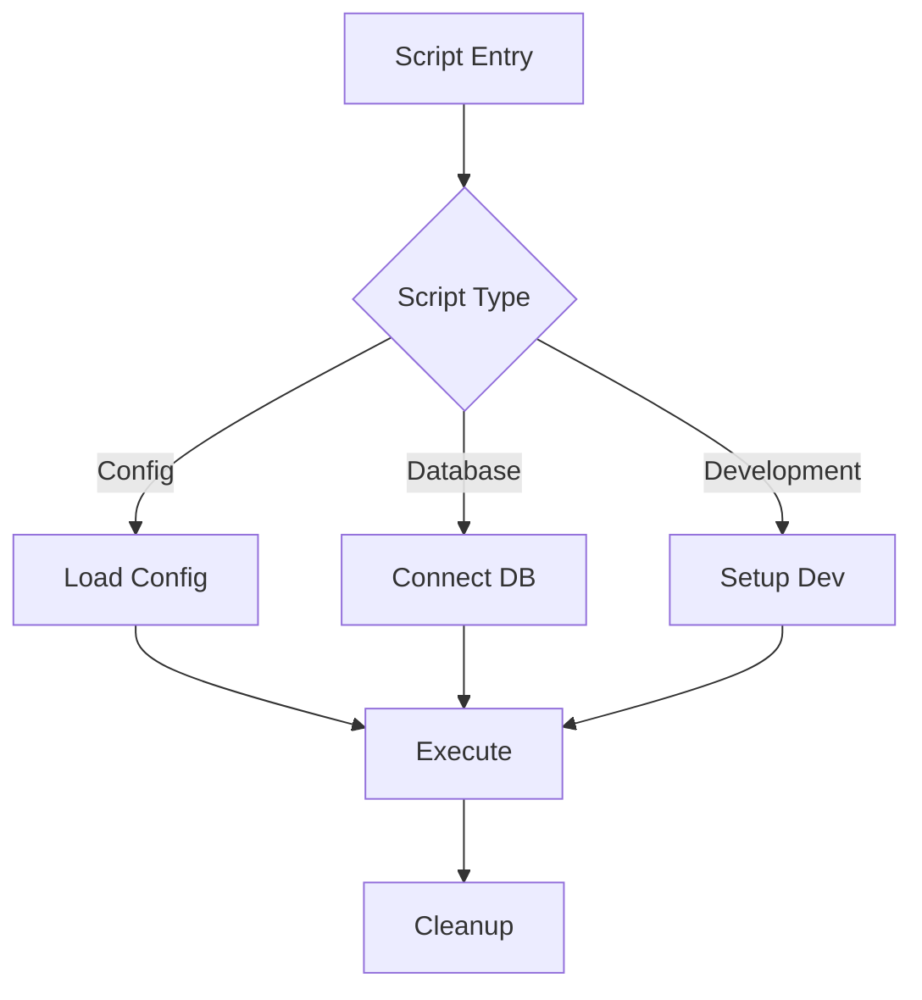

# JMF Hosting Discord Bot Architecture Overview
By JMFHosting

<div align="center">

[](https://discord.com/)
[](https://github.com/Nanaimo2013/Jmf-Bot/docs)
[](https://discord.js.org/)

</div>

## 🏗️ System Architecture

<table>
<tr>
<td width="50%">

### 📦 Core Components
```
+------------------+
|    User Layer    |
|  Discord Server  |
+------------------+
|  Command Layer   |
|  Slash Commands  |
+------------------+
|  Service Layer   |
|  Business Logic  |
+------------------+
|    Data Layer    |
|  Database & API  |
+------------------+
|  Discord.js API  |
|  Discord Gateway |
+------------------+
```

</td>
<td width="50%">

### 🔑 Key Features
- **Discord.js Integration**
  - Slash command support
  - Button interactions
  - Select menus
  - Modal forms
- **Modular Design**
  - Command categories
  - Event handlers
  - Service modules
  - Utility functions
- **Data Management**
  - MySQL database
  - Caching system
  - API integrations
  - Configuration management

</td>
</tr>
</table>

## 🚀 Bot Initialization Process

<table>
<tr>
<td width="25%">

### Configuration
[](https://github.com/Nanaimo2013/Jmf-Bot)
- Load environment variables
- Parse config.json
- Set up logging
- Initialize cache

</td>
<td width="25%">

### Client Setup
[](https://github.com/Nanaimo2013/Jmf-Bot)
- Create Discord client
- Register intents
- Set up event handlers
- Initialize collections

</td>
<td width="25%">

### Command Registration
[](https://github.com/Nanaimo2013/Jmf-Bot)
- Load command files
- Register command handlers
- Set up permissions
- Deploy to Discord API

</td>
<td width="25%">

### Service Initialization
[](https://github.com/Nanaimo2013/Jmf-Bot)
- Connect to database
- Initialize API clients
- Start scheduled tasks
- Set up event listeners

</td>
</tr>
</table>

## 🌐 API Integration

<table>
<tr>
<td width="50%">

### 🔌 REST API
[](https://github.com/Nanaimo2013/Jmf-Bot)
- Authentication with API keys
- Rate limiting protection
- Comprehensive endpoint documentation
- Error handling with standard HTTP codes
- JSON response format

</td>
<td width="50%">

### 🦅 Pterodactyl Integration
[](https://github.com/Nanaimo2013/Jmf-Bot)
- Server management endpoints
- User management endpoints
- Node and allocation management
- Database management
- Proxy authentication handling

</td>
</tr>
</table>

## 💾 Data Management

### 🗺️ Database Schema
```
+----------------+       +----------------+       +----------------+
|     Users      |       |    Tickets     |       |   Economy      |
+----------------+       +----------------+       +----------------+
| user_id (PK)   |<----->| ticket_id (PK) |       | user_id (PK)   |
| discord_id     |       | creator_id (FK)|       | balance        |
| username       |       | category       |       | bank           |
| joined_at      |       | status         |       | last_daily     |
| verified       |       | created_at     |       | inventory      |
| roles          |       | closed_at      |       | experience     |
| experience     |       | closed_by      |       | level          |
+----------------+       +----------------+       +----------------+
        |                        |                       |
        |                        |                       |
        v                        v                       v
+----------------+       +----------------+       +----------------+
|   Moderation   |       | TicketMessages |       |  Transactions  |
+----------------+       +----------------+       +----------------+
| case_id (PK)   |       | message_id (PK)|       | tx_id (PK)     |
| user_id (FK)   |       | ticket_id (FK) |       | user_id (FK)   |
| moderator_id   |       | author_id      |       | amount         |
| type           |       | content        |       | type           |
| reason         |       | timestamp      |       | timestamp      |
| timestamp      |       | attachments    |       | description    |
| active         |       |                |       | balance_after  |
+----------------+       +----------------+       +----------------+
```

### 📑 Unified Schema Approach
[](https://github.com/Nanaimo2013/Jmf-Bot)

The bot uses a unified database schema approach that works with both SQLite and MySQL:

- Single schema file (`unified-schema.sql`) for all database types
- Automatic handling of database-specific syntax differences
- Comprehensive table structure with all required columns
- Optimized indexes for better performance
- Support for all bot features in one schema

Key tables include:
- `users`: User information and tracking
- `tickets`: Support ticket management
- `user_balances`: Economy system
- `user_mining_data`: Mining game data
- `user_levels`: Leveling system
- `moderation_actions`: Moderation records
- `guild_settings`: Server configuration

### 📑 Caching Strategy
[](https://github.com/Nanaimo2013/Jmf-Bot)
- In-memory collections for commands and events
- User data caching with TTL
- Server configuration caching
- Pterodactyl API response caching

## 🖥️ Command System

<table>
<tr>
<td width="33%">

### ⌨️ Command Structure
[](https://github.com/Nanaimo2013/Jmf-Bot)
- Name and description
- Command options
- Permission requirements
- Execution function
- Cooldown settings

</td>
<td width="33%">

### 🖥️ Command Categories
[](https://github.com/Nanaimo2013/Jmf-Bot)
- Administration
- Moderation
- Economy
- Tickets
- Pterodactyl
- Mining
- Utility

</td>
<td width="33%">

### 💽 Command Handling
[](https://github.com/Nanaimo2013/Jmf-Bot)
- Permission checking
- Cooldown enforcement
- Error handling
- Logging
- Response formatting

</td>
</tr>
</table>

## 🛠️ Development Tools

<table>
<tr>
<td width="33%">

### 🏗️ Build System
[](https://github.com/Nanaimo2013/Jmf-Bot)
- npm scripts
- ESLint configuration
- GitHub Actions
- Docker builds

</td>
<td width="33%">

### 🐛 Debugging
[](https://github.com/Nanaimo2013/Jmf-Bot)
- Winston logging
- Rotating log files
- Error tracking
- Performance monitoring

</td>
<td width="33%">

### 📊 Testing
[](https://github.com/Nanaimo2013/Jmf-Bot)
- Unit testing framework
- Integration tests
- Mock Discord API
- Test coverage reporting

</td>
</tr>
</table>

---

<div align="center">

**[🏠 Home](../README.md)** •
**[📖 Documentation](README.md)** •
**[🚀 Roadmap](ROADMAP.md)**

Made with ❤️ by JMFHosting

</div>

## Future Architecture

### Planned Enhancements
1. **Microservices Architecture**
   - Split bot into multiple services
   - Message queue integration
   - Service discovery
   - Horizontal scaling

2. **Advanced Caching**
   - Redis integration
   - Distributed caching
   - Cache invalidation strategies
   - Performance optimization

3. **API Gateway**
   - Centralized API access
   - Rate limiting
   - Authentication
   - Request logging

## References
- [Discord.js Documentation](https://discord.js.org/)
- [Discord API Documentation](https://discord.com/developers/docs)
- [Pterodactyl API Documentation](https://dashflo.net/docs/api/pterodactyl/v1/)

## 📜 Script Architecture

<table>
<tr>
<td width="50%">

### 🔧 Script System Structure
```
scripts/
├── config/         # Configuration scripts
│   ├── manage-config.js
│   └── validate-config.js
├── database/       # Database scripts
│   ├── manage-database.js
│   └── fix-database.js
├── development/    # Development scripts
│   ├── dev-server.js
│   └── test-runner.js
├── deployment/     # Deployment scripts
│   ├── deploy.js
│   └── docker-deploy.js
└── utils/         # Utility scripts
    ├── generate-docs.js
    └── cleanup.js
```

</td>
<td width="50%">

### 🔄 Script Workflow


</td>
</tr>
</table>

### 📋 Script Base Classes

<table>
<tr>
<td width="50%">

#### BaseScript
```javascript
class BaseScript {
    constructor(options) {
        this.name = options.name;
        this.logger = options.logger;
        this.config = options.config;
    }

    async initialize() {
        await this.loadConfig();
        await this.validate();
    }

    async execute() {
        throw new Error('Must implement');
    }

    async cleanup() {
        // Cleanup resources
    }
}
```

</td>
<td width="50%">

#### ConfigScript
```javascript
class ConfigScript extends BaseScript {
    constructor(options) {
        super(options);
        this.configPath = options.configPath;
        this.backupDir = options.backupDir;
    }

    async validate() {
        // Validate configuration
    }

    async backup() {
        // Create backup
    }

    async restore() {
        // Restore from backup
    }
}
```

</td>
</tr>
</table>

### 🔌 Script Integration

<table>
<tr>
<td width="33%">

#### Event System
```javascript
// Script events
this.emit('scriptStart', {
    name: this.name,
    type: 'config',
    timestamp: Date.now()
});

// Error events
this.emit('scriptError', {
    error: error,
    context: this.context
});
```

</td>
<td width="33%">

#### Logging System
```javascript
// Script logging
this.logger.info('Starting script', {
    script: this.name,
    args: process.argv
});

// Error logging
this.logger.error('Script failed', {
    error: error,
    stack: error.stack
});
```

</td>
<td width="33%">

#### Progress Tracking
```javascript
// Progress updates
this.progress.update({
    stage: 'backup',
    percent: 50,
    message: 'Creating backup'
});

// Completion
this.progress.complete({
    success: true,
    duration: 1500
});
```

</td>
</tr>
</table>

### 🛠️ Script Utilities

<table>
<tr>
<td width="50%">

#### Configuration Utilities
```javascript
// Load configuration
async loadConfig() {
    const config = await readConfig();
    await validateConfig(config);
    return config;
}

// Save configuration
async saveConfig(config) {
    await validateConfig(config);
    await writeConfig(config);
    await createBackup(config);
}
```

</td>
<td width="50%">

#### Database Utilities
```javascript
// Database operations
async connectDatabase() {
    const connection = await createConnection();
    await validateConnection(connection);
    return connection;
}

// Migration utilities
async runMigration(migration) {
    await validateMigration(migration);
    await executeMigration(migration);
    await logMigration(migration);
}
```

</td>
</tr>
</table>

### 🔒 Script Security

<table>
<tr>
<td width="50%">

#### Permission Checking
```javascript
// Check permissions
async checkPermissions() {
    const perms = await getPermissions();
    validatePermissions(perms);
    return perms;
}

// Validate user
async validateUser() {
    const user = await getCurrentUser();
    validateUserPermissions(user);
    return user;
}
```

</td>
<td width="50%">

#### File Operations
```javascript
// Safe file operations
async safeWrite(path, data) {
    await validatePath(path);
    await createBackup(path);
    await atomicWrite(path, data);
}

// Secure deletion
async secureDelete(path) {
    await validatePath(path);
    await createBackup(path);
    await shredFile(path);
}
```

</td>
</tr>
</table> 